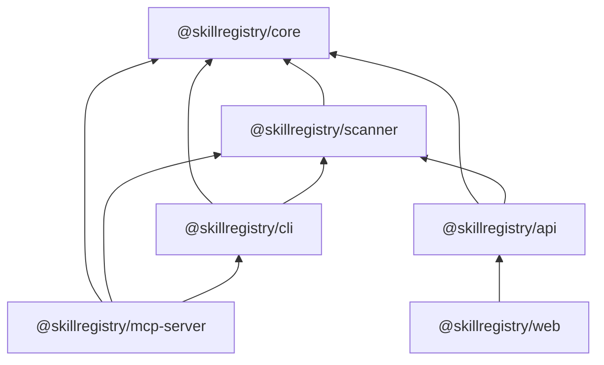

# SkillRegistry — Complete Implementation Plan

**Status:** Greenfield ([`c:\Users\kathu\Program Vickss\SkillRegistry`](c:\Users\kathu\Program Vickss\SkillRegistry) is empty).

**Dependency graph (no cycles):**

**Cross-cutting decisions (apply everywhere):**

| Decision | Choice | Trade-off |
|----------|--------|-----------|
| Search (MVP) | SQLite FTS5 via Turso/libSQL | No Meilisearch ops; weaker ranking than Meilisearch; upgrade path: sync index to Meilisearch later |
| Registry source of truth | Turso DB at runtime; `registry.json` for static/CI/offline CLI cache | Dual sync via `update-index.yml`; CLI caches tarball/index under `~/.cache/skillregistry/` |
| API envelope | `{ success, data, error, meta }` on every route | Slightly more bytes; consistent client parsing |
| Auth sessions | Arctic GitHub OAuth → HTTP-only cookie + JWT in cookie or short-lived access + refresh in DB | Arctic is lightweight; store `users` row on first login |
| MCP install | Programmatic import from `@skillregistry/cli` subpath export `./installer` | Avoids duplicating install logic; `cli` must not import `mcp-server` |
| Skill package format | Single folder: `SKILL.md` + optional `files/` subtree | Matches SKILL_SPEC; checksum = SHA-256 of normalized `SKILL.md` bytes |
| Versioning | Semver per skill name; DB unique on `(name, version)` | `add` resolves latest compatible unless pinned in lockfile |
| Block install | `blocked === true` OR `score < 30` OR any `critical` issue | User can override only with `--force` (logged) |

---

## Phase 1: Foundation

### Step 1.1 — Monorepo scaffold
**Complexity:** M | **Depends on:** nothing

**Files to create:**

| File | Contents |
|------|----------|
| [`package.json`](package.json) | `"private": true`, `"type": "module"`, scripts: `build`, `dev`, `test`, `lint`, `format`, `typecheck`; `packageManager": "pnpm@9.x"`; `engines`: `node>=20` |
| [`pnpm-workspace.yaml`](pnpm-workspace.yaml) | `packages: ['packages/*']` |
| [`turbo.json`](turbo.json) | Pipeline: `build` depends on `^build`; outputs `dist/**`, `.next/**`; `test` depends on `build`; `lint` no cache |
| [`tsconfig.base.json`](tsconfig.base.json) | `strict`, `module: NodeNext`, `moduleResolution: NodeNext`, `target: ES2022`, `declaration`, `declarationMap`, `sourceMap`, `noUncheckedIndexedAccess`, `exactOptionalPropertyTypes` |
| [`.prettierrc`](.prettierrc) | semi, singleQuote, trailingComma all, printWidth 100 |
| [`eslint.config.js`](eslint.config.js) | ESLint 9 flat config: `@eslint/js`, `typescript-eslint`, import rules, `no-explicit-any: error` |
| [`.gitignore`](.gitignore) | `node_modules`, `dist`, `.turbo`, `.next`, `.env*`, `*.db`, `.cache` |
| [`LICENSE`](LICENSE) | MIT full text |
| [`.nvmrc`](.nvmrc) | `20` |

**Per-package stub** (repeat for `core`, `scanner`, `cli`, `mcp-server`, `api`, `web`):

- `packages/<pkg>/package.json` — name `@skillregistry/<pkg>`, `"type": "module"`, `exports` map, `files: ["dist"]`
- `packages/<pkg>/tsconfig.json` — extends `../../tsconfig.base.json`, `outDir: dist`, `rootDir: src`
- `packages/<pkg>/tsup.config.ts` — ESM bundle, `dts: true`, `sourcemap: true`, entry `src/index.ts`
- `packages/<pkg>/vitest.config.ts` — `environment: node` (web: `jsdom`)
- `packages/<pkg>/README.md` — placeholder one-liner

**Root devDependencies:** `turbo`, `typescript@^5.5`, `prettier`, `eslint`, `typescript-eslint`, `vitest`, `@vitest/coverage-v8`

---

### Step 1.2 — `@skillregistry/core` types and constants
**Complexity:** M | **Depends on:** 1.1

**Dependencies:** `zod`, `semver`, `yaml` (for parser), `gray-matter` OR custom YAML split (prefer `yaml` + frontmatter regex for control)

**Files:**

#### [`packages/core/src/constants.ts`](packages/core/src/constants.ts)
- Export `AGENT_DIRS`, `SUPPORTED_AGENTS`, `CATEGORIES`, `MAX_DESCRIPTION_LENGTH = 200`, `MAX_CATEGORIES = 5`, `LOCKFILE_VERSION = 1`, `REGISTRY_API_DEFAULT = 'https://registry.skillregistry.dev/api/v1'`
- `AGENT_DIRS` exactly as spec (expand `~` at runtime in cli, not in core)

#### [`packages/core/src/types.ts`](packages/core/src/types.ts)
- All interfaces from spec: `Skill`, `AgentType`, `Category`, `SkillManifest`, `SkillFile`, `SecurityReport`, `SecurityIssue`, `RegistryIndex`, `RegistryEntry`
- Add: `ApiEnvelope<T>`, `LockFile`, `LockSkillEntry`, `PaginatedMeta`, `SkillSearchResult`, `InstallResult`, `InstalledSkill`, `UpdateAvailable`, `TrendingSkill`

#### [`packages/core/src/errors.ts`](packages/core/src/errors.ts)
- `SkillRegistryError` base (code, message, cause?)
- `ParseError`, `ValidationError`, `NotFoundError`, `SecurityBlockedError`, `VersionMismatchError`
- Each with `readonly code: string` for CLI/API mapping

#### [`packages/core/src/utils.ts`](packages/core/src/utils.ts)
- `slugify(name: string): string` — kebab-case enforce
- `compareVersions(a: string, b: string): -1 | 0 | 1` — wrap `semver`
- `hashContent(content: string): string` — SHA-256 hex
- `normalizeSkillName(name: string): string`
- `expandHomePath(path: string): string` — `~` → `os.homedir()`

#### [`packages/core/src/index.ts`](packages/core/src/index.ts)
- Barrel re-export all public modules

---

### Step 1.3 — Zod schema and parser
**Complexity:** L | **Depends on:** 1.2

#### [`packages/core/src/schema.ts`](packages/core/src/schema.ts)
- `agentTypeSchema` — z.enum of 7 agents
- `categorySchema` — z.enum of 14 categories
- `skillFrontmatterSchema` — all Skill fields except runtime fields; `.max(200)` on description; categories `.max(5)`; tags array
- `skillManifestSchema` — frontmatter + `content` + `files` array with `path`, `content`, `type`
- `registryIndexSchema`, `lockFileSchema`
- Export inferred types: `SkillFrontmatter`, `SkillFrontmatterInput`

#### [`packages/core/src/parser.ts`](packages/core/src/parser.ts)
- `parseSkillMd(raw: string): { frontmatter: Record<string, unknown>; body: string }` — split on `---` lines; use `yaml` parse
- `parseSkillFile(filePath: string): Promise<SkillManifest>` — read disk, parse, validate with Zod
- `parseSkillFromString(raw: string): SkillManifest` — combine + validate
- `serializeSkillMd(manifest: SkillManifest): string` — rebuild SKILL.md
- `extractFrontmatterOnly(raw: string): Skill` — for index generation

**JSDoc** on every exported function.

---

### Step 1.4 — Core tests
**Complexity:** M | **Depends on:** 1.3

#### [`packages/core/src/__tests__/parser.test.ts`](packages/core/src/__tests__/parser.test.ts)
- Valid SKILL.md fixture, invalid YAML, missing required fields, max categories/tags

#### [`packages/core/src/__tests__/schema.test.ts`](packages/core/src/__tests__/schema.test.ts)
- Edge cases: wrong agent, description > 200 chars

#### [`packages/core/src/__tests__/utils.test.ts`](packages/core/src/__tests__/utils.test.ts)
- Semver compare, hash stability

**Fixtures:** [`packages/core/src/__tests__/fixtures/valid-skill/SKILL.md`](packages/core/src/__tests__/fixtures/valid-skill/SKILL.md)

**Coverage target:** 80%+ enforced in `vitest.config` `coverage.thresholds`

---

## Phase 2: Security Engine

### Step 2.1 — Patterns and scoring
**Complexity:** M | **Depends on:** Phase 1

#### [`packages/scanner/src/patterns.ts`](packages/scanner/src/patterns.ts)
- Export grouped `RegExp` and string literals:
  - Prompt injection: "ignore previous", "disregard instructions", role-play jailbreaks, XML/tag injection
  - Exfil: `fetch(`, `curl`, `webhook`, `pastebin`, `discord.com/api/webhooks`, reading `.env`, `process.env`, `fs.readFile` + network
  - Secrets: AWS keys, GitHub tokens, `sk-`, `Bearer`, private key blocks
  - Dangerous: `rm -rf`, `format c:`, `curl \| bash`, `wget -O- \| sh`
  - Obfuscation: base64 long strings, `\xNN`, `atob(`, `eval(`
  - Privilege: `sudo`, `chmod 777`, `chown`, `setuid`
  - External: suspicious TLDs, raw IP URLs, unknown CDN patterns

#### [`packages/scanner/src/scoring.ts`](packages/scanner/src/scoring.ts)
- `calculateScore(issues: SecurityIssue[]): number` — algorithm from spec
- `isBlocked(issues: SecurityIssue[], score: number): boolean` — `score < 30 || critical.length > 0`
- `passed(score: number): boolean` — `score >= 50`

---

### Step 2.2 — Eight security checks
**Complexity:** XL | **Depends on:** 2.1

Each file exports default `CheckFunction` + issue code constants.

| File | Logic | Issue codes |
|------|-------|-------------|
| [`checks/prompt-injection.ts`](packages/scanner/src/checks/prompt-injection.ts) | Line-scan body + frontmatter strings; severity critical for explicit override instructions | `PROMPT_INJECTION` |
| [`checks/data-exfiltration.ts`](packages/scanner/src/checks/data-exfiltration.ts) | Network + env + filesystem patterns | `DATA_EXFIL` |
| [`checks/secret-detection.ts`](packages/scanner/src/checks/secret-detection.ts) | Entropy + regex for keys; mask evidence in report | `SECRET_LEAK` |
| [`checks/dangerous-commands.ts`](packages/scanner/src/checks/dangerous-commands.ts) | Shell one-liners in markdown code fences and inline | `DANGEROUS_CMD` |
| [`checks/obfuscation.ts`](packages/scanner/src/checks/obfuscation.ts) | Long base64, hex runs | `OBFUSCATION` |
| [`checks/privilege-escalation.ts`](packages/scanner/src/checks/privilege-escalation.ts) | sudo/chmod patterns | `PRIV_ESC` |
| [`checks/external-fetches.ts`](packages/scanner/src/checks/external-fetches.ts) | URL extraction + allowlist (github.com, npmjs.org) vs block | `EXTERNAL_FETCH` |
| [`checks/schema-validation.ts`](packages/scanner/src/checks/schema-validation.ts) | Run `skillFrontmatterSchema` on metadata; map Zod issues to SecurityIssue medium | `SCHEMA_INVALID` |

**Shared helper:** [`packages/scanner/src/checks/utils.ts`](packages/scanner/src/checks/utils.ts) — `lineNumber(content, index)`, `snippet(content, line)`, dedupe issues by code+line

---

### Step 2.3 — Scanner orchestrator
**Complexity:** M | **Depends on:** 2.2

#### [`packages/scanner/src/scanner.ts`](packages/scanner/src/scanner.ts)
- `scanSkill(content: string, metadata: Skill): SecurityReport`
- `scanManifest(manifest: SkillManifest): SecurityReport`
- `scanPath(dir: string): Promise<SecurityReport>` — read SKILL.md
- Register checks in ordered array; aggregate issues; attach `scanned_at` ISO string

#### [`packages/scanner/src/index.ts`](packages/scanner/src/index.ts)
- Export `scanSkill`, `scanManifest`, `scanPath`, scoring helpers

---

### Step 2.4 — Scanner tests
**Complexity:** L | **Depends on:** 2.3

#### Fixtures (known-bad)
- [`packages/scanner/src/__tests__/fixtures/bad-prompt-injection/SKILL.md`](packages/scanner/src/__tests__/fixtures/bad-prompt-injection/SKILL.md)
- `bad-exfil`, `bad-secrets`, `bad-commands`, `bad-clean` (score ~100)

#### [`packages/scanner/src/__tests__/scanner.test.ts`](packages/scanner/src/__tests__/scanner.test.ts)
- Assert blocked on critical, score thresholds, each check fires at least once

#### [`packages/scanner/src/__tests__/scoring.test.ts`](packages/scanner/src/__tests__/scoring.test.ts)
- Point deduction math

---

## Phase 3: CLI Tool

### Step 3.1 — CLI infrastructure
**Complexity:** M | **Depends on:** Phases 1–2

**Package:** [`packages/cli/package.json`](packages/cli/package.json)
- `bin`: `{ "skillregistry": "./dist/index.js", "skr": "./dist/index.js" }`
- `exports`: `{ ".": "...", "./installer": "./dist/utils/installer.js" }`
- deps: `commander`, `inquirer`, `chalk`, `ora`, `cli-table3`, `conf` or plain JSON for config, `node-fetch`/`undici`, `fs-extra`, `@skillregistry/core`, `@skillregistry/scanner`

#### [`packages/cli/src/index.ts`](packages/cli/src/index.ts)
- Commander program `skillregistry` / alias note in help
- Global options: `--json`, `--verbose`, `--registry <url>`
- Register all subcommands; exit codes: 0 success, 1 error, 2 security blocked

#### [`packages/cli/src/utils/config.ts`](packages/cli/src/utils/config.ts)
- Path: `~/.skillregistry/config.json`
- Schema: `{ registryUrl?, defaultAgent?, cacheTtl?, offlineMode? }`
- `getConfig()`, `setConfig(partial)`

#### [`packages/cli/src/utils/cache.ts`](packages/cli/src/utils/cache.ts)
- `~/.cache/skillregistry/`: `index.json`, `skills/<name>/<version>/`
- `getCachedIndex()`, `setCachedIndex()`, `getSkillCache(name, version)`, TTL from config

#### [`packages/cli/src/utils/display.ts`](packages/cli/src/utils/display.ts)
- `printTable`, `printSecurityReport`, `spinner`, `success/error/info` wrappers (chalk + ora)

#### [`packages/cli/src/utils/lock-file.ts`](packages/cli/src/utils/lock-file.ts)
- `readLockFile(cwd)`, `writeLockFile`, `upsertSkillEntry`, `removeSkillEntry`
- Validate with `lockFileSchema`

#### [`packages/cli/src/utils/agent-detector.ts`](packages/cli/src/utils/agent-detector.ts)
- Implement detection rules from spec; return `AgentType[]` and per-agent `{ installed: boolean, reason?: string }`

---

### Step 3.2 — Downloader and installer
**Complexity:** L | **Depends on:** 3.1

#### [`packages/cli/src/utils/downloader.ts`](packages/cli/src/utils/downloader.ts)
- `resolveSkill(name, version?)` — fetch registry API or local `registry.json` in monorepo dev
- `downloadSkill(manifest): Promise<{ path, checksum }>` — verify SHA-256
- Offline: use cache; throw typed error with hint if missing

#### [`packages/cli/src/utils/installer.ts`](packages/cli/src/utils/installer.ts)
- `installSkill({ manifest, agents, global, projectDir })` — copy `SKILL.md` to each `AGENT_DIRS` (project-relative vs homedir)
- `uninstallSkill(name, agents?)`
- `listInstalled(agent?)` — scan dirs for SKILL.md, parse frontmatter
- Block if scanner says blocked unless `force: true`

---

### Step 3.3 — Commands (12)
**Complexity:** XL | **Depends on:** 3.2

| Command file | Behavior |
|--------------|----------|
| [`commands/init.ts`](packages/cli/src/commands/init.ts) | Write empty `skillregistry.lock.json` v1 in cwd |
| [`commands/search.ts`](packages/cli/src/commands/search.ts) | API `GET /search` or local index filter; table output |
| [`commands/add.ts`](packages/cli/src/commands/add.ts) | Download → scan → install → update lock; flags `--agent`, `--global`, `--force` |
| [`commands/remove.ts`](packages/cli/src/commands/remove.ts) | Uninstall + lock prune |
| [`commands/list.ts`](packages/cli/src/commands/list.ts) | Installed skills table |
| [`commands/info.ts`](packages/cli/src/commands/info.ts) | Metadata + security report from API/cache |
| [`commands/scan.ts`](packages/cli/src/commands/scan.ts) | Local path scan; print report |
| [`commands/create.ts`](packages/cli/src/commands/create.ts) | Inquirer wizard; scaffold `skills/<name>/SKILL.md` template |
| [`commands/publish.ts`](packages/cli/src/commands/publish.ts) | POST skill (needs auth token in config); pre-scan |
| [`commands/update.ts`](packages/cli/src/commands/update.ts) | Compare lock versions to registry; update all or one |
| [`commands/audit.ts`](packages/cli/src/commands/audit.ts) | Re-scan all installed; summary table |
| [`commands/doctor.ts`](packages/cli/src/commands/doctor.ts) | Agents, dirs writable, registry reachable, cache stats |

---

### Step 3.4 — CLI tests
**Complexity:** L | **Depends on:** 3.3

- Use `vitest` + `execa` to run CLI in temp dirs
- Mock `fetch` for registry
- [`packages/cli/src/__tests__/add.test.ts`](packages/cli/src/__tests__/add.test.ts) — blocked skill fails without `--force`
- [`packages/cli/src/__tests__/lock-file.test.ts`](packages/cli/src/__tests__/lock-file.test.ts)

---

## Phase 4: Registry Backend

### Step 4.1 — Database schema and client
**Complexity:** L | **Depends on:** Phase 1

**Dependencies:** `hono`, `@hono/node-server`, `drizzle-orm`, `@libsql/client`, `arctic`, `jose` (JWT), `zod`, `@skillregistry/core`, `@skillregistry/scanner`

#### [`packages/api/src/db/schema.ts`](packages/api/src/db/schema.ts)
- Drizzle tables exactly as spec (use `text`, `integer`, `sqlite` booleans)
- Relations: `skills` → `users`; many-to-many via `skill_agents`, `skill_categories`, `skill_tags`
- Indexes: `skills.name`, `(name, version)` unique, FTS virtual table `skills_fts`

#### [`packages/api/src/db/client.ts`](packages/api/src/db/client.ts)
- `createDb(url, authToken?)` from env `TURSO_DATABASE_URL`, `TURSO_AUTH_TOKEN`

#### [`packages/api/src/db/migrations/0000_initial.sql`](packages/api/src/db/migrations/0000_initial.sql)
- Full DDL + FTS5: `CREATE VIRTUAL TABLE skills_fts USING fts5(name, description, tags, content=skills, content_rowid=id)`

#### [`packages/api/drizzle.config.ts`](packages/api/drizzle.config.ts)
- Drizzle Kit for migrations

---

### Step 4.2 — Middleware and app shell
**Complexity:** M | **Depends on:** 4.1

| File | Role |
|------|------|
| [`src/middleware/cors.ts`](packages/api/src/middleware/cors.ts) | Allow web origin from env |
| [`src/middleware/rate-limit.ts`](packages/api/src/middleware/rate-limit.ts) | In-memory sliding window per IP (CF: use KV later); 100 req/min public, 20/min publish |
| [`src/middleware/auth.ts`](packages/api/src/middleware/auth.ts) | Verify JWT from cookie/header; attach `user` to context |
| [`src/lib/envelope.ts`](packages/api/src/lib/envelope.ts) | `ok(data, meta?)`, `fail(code, message, status)` |
| [`src/lib/validate.ts`](packages/api/src/lib/validate.ts) | Zod validator middleware for Hono |
| [`src/index.ts`](packages/api/src/index.ts) | `createApp()` — mount routes, export for Node server + `fetch` handler (Workers-ready) |

---

### Step 4.3 — Services
**Complexity:** L | **Depends on:** 4.2

#### [`src/services/scanner.ts`](packages/api/src/services/scanner.ts)
- Wrap `scanManifest`; persist to `security_reports`; update `skills.security_score`

#### [`src/services/search.ts`](packages/api/src/services/search.ts)
- `searchSkills(q, filters)` — FTS5 `MATCH` with pagination; fallback `LIKE` if FTS empty
- Sync FTS on skill insert/update triggers or explicit `reindexSkill(id)`

#### [`src/services/trending.ts`](packages/api/src/services/trending.ts)
- Score = downloads in window / age decay; periods day/week/month from `downloads` table

#### [`src/services/skills.ts`](packages/api/src/services/skills.ts)
- CRUD, version list, checksum verify on publish

---

### Step 4.4 — Routes
**Complexity:** XL | **Depends on:** 4.3

| Route file | Endpoints |
|------------|-----------|
| [`routes/skills.ts`](packages/api/src/routes/skills.ts) | List, get, versions, security, download (increment downloads), POST/PUT/DELETE publish |
| [`routes/search.ts`](packages/api/src/routes/search.ts) | `GET /search` |
| [`routes/trending.ts`](packages/api/src/routes/trending.ts) | `GET /trending` |
| [`routes/authors.ts`](packages/api/src/routes/authors.ts) | Author profile + skills |
| [`routes/scan.ts`](packages/api/src/routes/scan.ts) | `POST /scan` body `{ content, metadata? }` |
| [`routes/stats.ts`](packages/api/src/routes/stats.ts) | Totals: skills, downloads, authors |
| [`routes/auth.ts`](packages/api/src/routes/auth.ts) | Arctic GitHub OAuth, callback, me, logout |
| [`routes/collections.ts`](packages/api/src/routes/collections.ts) | Optional MVP: list/create collection; defer analytics |

**Publish flow:** auth → validate manifest → scan → if blocked return 422 → insert skill + relations + FTS + security_report

**Download flow:** track `downloads` with hashed IP (`ip_hash`), return tarball JSON `{ SKILL.md, files[] }` or raw markdown

---

### Step 4.5 — API tests
**Complexity:** L | **Depends on:** 4.4

- `vitest` + `hono/testing` + in-memory libSQL (`:memory:`)
- Test envelope shape, rate limit headers, publish blocked skill, search

---

## Phase 5: MCP Server

### Step 5.1 — Server bootstrap
**Complexity:** M | **Depends on:** Phases 1–3 (API optional: use env `SKILLREGISTRY_API_URL`)

#### [`packages/mcp-server/src/index.ts`](packages/mcp-server/src/index.ts)
- Stdio transport via `@modelcontextprotocol/sdk/server`
- Register tools + resources; `Server` capabilities

#### [`packages/mcp-server/src/client.ts`](packages/mcp-server/src/client.ts)
- Typed fetch wrapper to API envelope

---

### Step 5.2 — Tools (7)
**Complexity:** L | **Depends on:** 5.1

| Tool file | Maps to |
|-----------|---------|
| [`tools/search.ts`](packages/mcp-server/src/tools/search.ts) | `search_skills` |
| [`tools/get-skill.ts`](packages/mcp-server/src/tools/get-skill.ts) | `get_skill` |
| [`tools/install.ts`](packages/mcp-server/src/tools/install.ts) | `install_skill` → import `@skillregistry/cli/installer` |
| [`tools/list-installed.ts`](packages/mcp-server/src/tools/list-installed.ts) | `list_installed` |
| [`tools/check-updates.ts`](packages/mcp-server/src/tools/check-updates.ts) | `check_updates` |
| [`tools/scan.ts`](packages/mcp-server/src/tools/scan.ts) | `scan_skill` → scanner |
| [`tools/trending.ts`](packages/mcp-server/src/tools/trending.ts) | `get_trending` |

Each tool: Zod input schema, JSDoc, structured JSON content response.

---

### Step 5.3 — Resources (3)
**Complexity:** M | **Depends on:** 5.1

| Resource | URI | Content |
|----------|-----|---------|
| [`resources/catalog.ts`](packages/mcp-server/src/resources/catalog.ts) | `skillregistry://catalog` | `registry.json` or API list |
| [`resources/skill.ts`](packages/mcp-server/src/resources/skill.ts) | `skillregistry://skill/{name}` | Full SKILL.md |
| [`resources/security.ts`](packages/mcp-server/src/resources/security.ts) | `skillregistry://security/{name}` | SecurityReport JSON |

---

### Step 5.4 — MCP tests
**Complexity:** M | **Depends on:** 5.2–5.3

- Invoke tool handlers directly with mocked API
- Snapshot JSON schemas

---

## Phase 6: Web UI

### Step 6.1 — Next.js 15 app scaffold
**Complexity:** M | **Depends on:** Phase 4 (API running)

#### [`packages/web/package.json`](packages/web/package.json)
- `next@15`, `react@19`, `tailwindcss@4`, `@tailwindcss/postcss`, shadcn deps, `recharts`, `lucide-react`

#### [`packages/web/app/layout.tsx`](packages/web/app/layout.tsx)
- Root layout, fonts, metadata, `ThemeProvider`

#### [`packages/web/app/globals.css`](packages/web/app/globals.css)
- Tailwind 4 imports

#### [`packages/web/components.json`](packages/web/components.json)
- shadcn init (new-york or default)

#### [`packages/web/lib/api.ts`](packages/web/lib/api.ts)
- `fetchApi<T>(path)` — parses envelope, throws on `!success`

#### [`packages/web/lib/auth.ts`](packages/web/lib/auth.ts)
- Server actions / cookies for session

---

### Step 6.2 — Shared components
**Complexity:** L | **Depends on:** 6.1

| Component | Path | Notes |
|-----------|------|-------|
| SkillCard | [`components/skill-card.tsx`](packages/web/components/skill-card.tsx) | SecurityBadge, AgentBadge, link to detail |
| SecurityBadge | [`components/security-badge.tsx`](packages/web/components/security-badge.tsx) | Green ≥80, blue ≥50, red below |
| AgentBadge | [`components/agent-badge.tsx`](packages/web/components/agent-badge.tsx) | Icons per agent |
| SearchBar | [`components/search-bar.tsx`](packages/web/components/search-bar.tsx) | Cmd+K dialog (shadcn Command) |
| CategoryGrid | [`components/category-grid.tsx`](packages/web/components/category-grid.tsx) | |
| TrendingList | [`components/trending-list.tsx`](packages/web/components/trending-list.tsx) | |
| InstallCommand | [`components/install-command.tsx`](packages/web/components/install-command.tsx) | `npx skillregistry add ...` |
| SkillReadme | [`components/skill-readme.tsx`](packages/web/components/skill-readme.tsx) | `react-markdown` + sanitization |
| SecurityReport | [`components/security-report.tsx`](packages/web/components/security-report.tsx) | Issues list with severity chips |
| CompatibilityMatrix | [`components/compatibility-matrix.tsx`](packages/web/components/compatibility-matrix.tsx) | |
| DownloadChart | [`components/download-chart.tsx`](packages/web/components/download-chart.tsx) | Recharts |
| ContributorGraph | [`components/contributor-graph.tsx`](packages/web/components/contributor-graph.tsx) | CSS grid heatmap |

**Accessibility:** focus rings, aria labels on badges, keyboard nav in Command palette; test with `@testing-library/react` + `jest-axe` optional

---

### Step 6.3 — Pages (App Router)
**Complexity:** XL | **Depends on:** 6.2

| Route | Server/Client | Data |
|-------|---------------|------|
| [`app/page.tsx`](packages/web/app/page.tsx) | RSC | trending, categories, search |
| [`app/skills/page.tsx`](packages/web/app/skills/page.tsx) | RSC + filters | paginated skills |
| [`app/skills/[name]/page.tsx`](packages/web/app/skills/[name]/page.tsx) | RSC | skill detail |
| [`app/skills/[name]/security/page.tsx`](packages/web/app/skills/[name]/security/page.tsx) | RSC | security report |
| [`app/categories/[category]/page.tsx`](packages/web/app/categories/[category]/page.tsx) | RSC | |
| [`app/authors/[username]/page.tsx`](packages/web/app/authors/[username]/page.tsx) | RSC | |
| [`app/collections/page.tsx`](packages/web/app/collections/page.tsx) | RSC | |
| [`app/collections/[name]/page.tsx`](packages/web/app/collections/[name]/page.tsx) | RSC | |
| [`app/trending/page.tsx`](packages/web/app/trending/page.tsx) | RSC | |
| [`app/docs/...`](packages/web/app/docs) | MDX or static markdown | getting-started, creating-skills, security, mcp-server |
| [`app/auth/login/page.tsx`](packages/web/app/auth/login/page.tsx) | client | redirect to API OAuth |
| [`app/dashboard/...`](packages/web/app/dashboard) | protected | my skills, analytics, settings |

---

### Step 6.4 — Web tests
**Complexity:** M | **Depends on:** 6.3

- Component tests for SecurityBadge, SkillCard
- E2E optional (Playwright) — not required for 80% if component coverage sufficient

---

## Phase 7: Content

### Step 7.1 — SKILL_SPEC and example lock
**Complexity:** M | **Depends on:** Phase 1

#### [`SKILL_SPEC.md`](SKILL_SPEC.md)
- Frontmatter field reference, agent/category enums, file layout, versioning, security requirements, publishing checklist

#### [`skillregistry.lock.json`](skillregistry.lock.json)
- Example with 2–3 fictional skills

---

### Step 7.2 — 20 seed skills
**Complexity:** XL | **Depends on:** 7.1, scanner

**Directory layout per skill:** [`skills/<name>/SKILL.md`](skills/react-expert/SKILL.md) + optional `examples/`, `references/`

| Category | Skills (name) |
|----------|----------------|
| Frontend (5) | react-expert, nextjs-expert, vue-master, tailwind-pro, a11y-audit |
| Backend (4) | postgres-expert, redis-patterns, api-design, graphql-expert |
| Security (3) | owasp-security, jwt-hardening, input-validation |
| DevOps (3) | docker-expert, github-actions, ci-cd-patterns |
| AI/ML (3) | mcp-builder, prompt-engineer, rag-patterns |
| Code Quality (2) | test-driven, refactor-expert |

Each skill: 150–400 lines of real guidance, valid frontmatter, `agents` array, run through scanner locally (score ≥ 80)

---

### Step 7.3 — `registry.json` generator
**Complexity:** S | **Depends on:** 7.2

#### [`scripts/generate-registry-index.ts`](scripts/generate-registry-index.ts)
- Walk `skills/`, parse frontmatter, compute checksum, run scanner for `security_score`, output root [`registry.json`](registry.json)

**Root [`registry.json`](registry.json):** `version`, `updated_at`, `skills` record keyed by name

---

## Phase 8: CI/CD

### Step 8.1 — Workflows
**Complexity:** M | **Depends on:** Phases 1–7

#### [`.github/workflows/scan.yml`](.github/workflows/scan.yml)
- On PR touching `skills/**`: run `pnpm exec skillregistry scan` per changed skill; fail if blocked

#### [`.github/workflows/publish.yml`](.github/workflows/publish.yml)
- On tag `v*`: build all packages, `pnpm publish -r --access public` with NPM_TOKEN

#### [`.github/workflows/update-index.yml`](.github/workflows/update-index.yml)
- On push to `main` when `skills/**` changes: run generator, commit `registry.json` if diff

**Also:** `ci.yml` — lint, typecheck, test, coverage upload (optional)

---

### Step 8.2 — Issue templates
**Complexity:** S | **Depends on:** nothing

- [`.github/ISSUE_TEMPLATE/new-skill.md`](.github/ISSUE_TEMPLATE/new-skill.md) — checklist: SKILL_SPEC, scan score, agents
- [`.github/ISSUE_TEMPLATE/security-report.md`](.github/ISSUE_TEMPLATE/security-report.md) — responsible disclosure

---

## Phase 9: Docs

### Step 9.1 — README and contributing
**Complexity:** M | **Depends on:** all packages

#### [`README.md`](README.md)
- Hero, problem statement, 8-point scanner comparison table vs npm/cursor rules, quickstart (`npx skillregistry add react-expert`), architecture diagram, monorepo map, license

#### [`CONTRIBUTING.md`](CONTRIBUTING.md)
- Dev setup, pnpm install, turbo build, adding skills, PR scan requirements

#### [`SECURITY.md`](SECURITY.md)
- Disclosure policy, scanner limitations disclaimer

---

## Environment variables (reference)

| Var | Package | Purpose |
|-----|---------|---------|
| `TURSO_DATABASE_URL`, `TURSO_AUTH_TOKEN` | api | DB |
| `GITHUB_CLIENT_ID`, `GITHUB_CLIENT_SECRET` | api | OAuth |
| `JWT_SECRET`, `WEB_URL` | api, web | Sessions/CORS |
| `SKILLREGISTRY_API_URL` | cli, mcp, web | API base |
| `NPM_TOKEN` | CI | Publish |

---

## Suggested implementation order (single developer)

1. Phase 1 (Steps 1.1–1.4) → 2–3 days  
2. Phase 2 → 2–3 days  
3. Phase 3 → 4–5 days  
4. Phase 4 → 4–5 days  
5. Phase 5 → 1–2 days  
6. Phase 6 → 5–7 days  
7. Phases 7–9 → 3–4 days  

**Total estimate:** ~22–30 dev-days for MVP per spec (20 seed skills, FTS search, full CLI/API/MCP/web).

---

## Risk register

- **FTS5 on Turso:** confirm FTS5 support on target Turso libSQL version; if unavailable, fall back to `LIKE` + in-memory fuse.js for MVP only  
- **Arctic + Next.js cookies:** ensure OAuth callback sets cookie domain correctly in prod  
- **MCP + CLI coupling:** keep installer logic in `cli/src/utils/installer.ts` only; export subpath to prevent circular imports  
- **80% coverage:** enforce per-package in CI; web may combine unit + component tests  

---

## Definition of done (MVP)

- [ ] `pnpm build` succeeds across all packages  
- [ ] `skillregistry add react-expert` installs to detected agents after scan pass  
- [ ] `skillregistry scan skills/` passes for all seeds  
- [ ] API serves skills, search, auth, publish with envelope  
- [ ] Web lists skills, shows security page, OAuth login  
- [ ] MCP tools callable from Cursor MCP config  
- [ ] `registry.json` generated; CI scan workflow green on PR  
